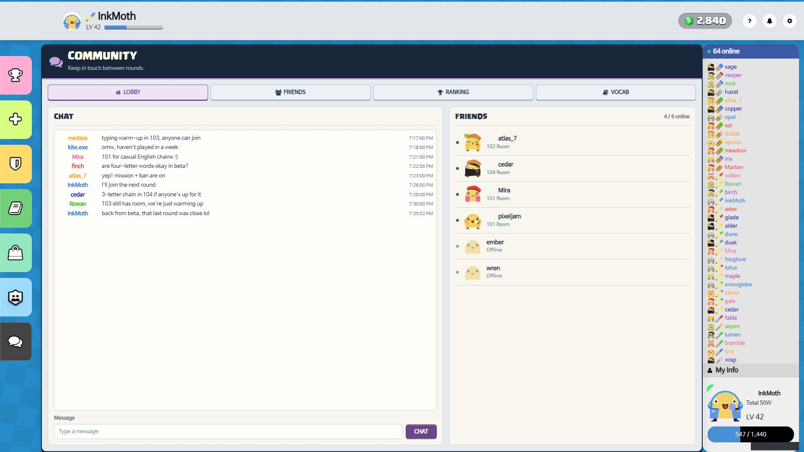

# WordWarrior.io — release screenshots

Seven complete **1920 × 1080** screenshots captured on **October 9, 2026** in the Codex in-app browser. Use **01-gameplay.jpg** as the lead image for the GitHub release.

These are real browser captures of the project's existing game templates, styles, avatar assets, and client renderers. Players, rooms, inventory, and conversations are fictional demo data. The local harness simulates server messages and player actions in memory; it does not represent a live production population or test independent network clients.

The supplied `game_img/8e9a668b-3569-4fbb-990e-af576027c7d9.png` is fitted with `background-size: cover`, centered without stretching, for the demo match only. Production backgrounds and game UI files were not changed for these captures. All twelve player cards fit in the gameplay and ready-room images.

The JPEGs are the original browser response bytes, with no image editing, resizing, compositing, or post-capture cropping. The capture rectangle is the entire 1920 × 1080 browser content viewport. [manifest.json](manifest.json) records dimensions and hashes; [capture-provenance.json](capture-provenance.json) records capture actions, URLs, timestamps, and source hashes.

## Gameplay

A twelve-player Beta Test match in round two, with Mission and Ban Letter enabled. InkMoth submitted `novel` through the actual input, then eleven simulated players took their turns. The chain reached **24**, all twelve scores updated, and InkMoth is drafting `kite` for the next turn. The latest words and definitions remain visible at right.


## Lobby

**64 simulated users and 24 rooms**, with varied occupancy, active and waiting sessions, concise room titles, and coordinated avatars.


## Ready room

Twelve complete player cards, host and readiness states, natural nicknames, and a short pre-game conversation. The outfits use coordinated existing cosmetic layers with at most one hand item.


## Inventory

InkMoth's **48 owned item entries** include cosmetics, nickname colors, backgrounds, consumables, emblems, and chest tiers. Equipped items and quantities use the native interface.


## Chest opening

Opening a Silver emblem chest through its native button awarded a **Steel emblem with seven days of use** and reduced the remaining chest count from **three to two**.


## Store

Cat ears, Pink vest, and Cat smile were selected through the actual catalog. The preview shows the outfit; the cart totals **1,900 gems**, leaving **940** from the starting balance of 2,840.


## Community chat

Nine natural chat messages, friend avatars, four online friends, and room presence. The final InkMoth message was submitted through the actual chat controls.



## Reproduce

From the repository root, using the already-installed Pug and Acorn dependencies:

```powershell
Get-Content -Raw -LiteralPath tools/demo_game_server.js | node --preserve-symlinks
```

Other shells:

```sh
node --preserve-symlinks --preserve-symlinks-main tools/demo_game_server.js
```

Open `http://127.0.0.1:4174/` with a **1920 × 1080 browser content viewport**, 100% zoom, and device pixel ratio 1. Wait for fonts, avatar images, and `body[data-demo-ready="true"]`. Capture the entire viewport without browser chrome. `GAME_DEMO_PORT` can override the loopback-only port.

| File | Query | Action |
| --- | --- | --- |
| 01-gameplay.jpg | `?view=game` | Submit `novel`, press Alt + Right eleven times, then type `kite` without submitting. |
| 02-lobby.jpg | `?view=lobby` | Capture the populated lobby. |
| 03-ready-room.jpg | `?view=room` | Capture the ready room and chat. |
| 04-inventory.jpg | `?view=inventory` | Capture the initial inventory. |
| 05-chest-opening.jpg | `?view=inventory` | Select Silver emblem chest, click Open Chest, wait for the reward reveal. |
| 06-store.jpg | `?view=shop` | Select Cat ears, Pink vest, and Cat smile. |
| 08-community-chat.jpg | `?view=community` | Send `back from beta, that last round was close lol` through Message / Chat. |

Reloading resets the local simulation. No database, OAuth, or production services are used. The unchanged `07-login.jpg` is a legacy capture and is excluded from this release set and manifest.

## Verification

- Visually inspected all seven exports at their complete viewport dimensions.
- Verified all twelve gameplay and ready-room cards are visible, including names and scores/readiness.
- Exercised word submission, simulated player turns, chest consumption/reward, store selection, and chat submission through the existing controls.
- Validated fixture names, room membership, host/readiness state, cosmetic IDs, ownership, and emblem expiry.
- Confirmed all seven files are 1920 × 1080 and their SHA-256 hashes match the original browser responses.
- No browser warnings or errors were observed during the final capture pass.

Existing source and asset licenses apply; see the repository [README](../../README.md#license) and [LICENSE](../../LICENSE).
