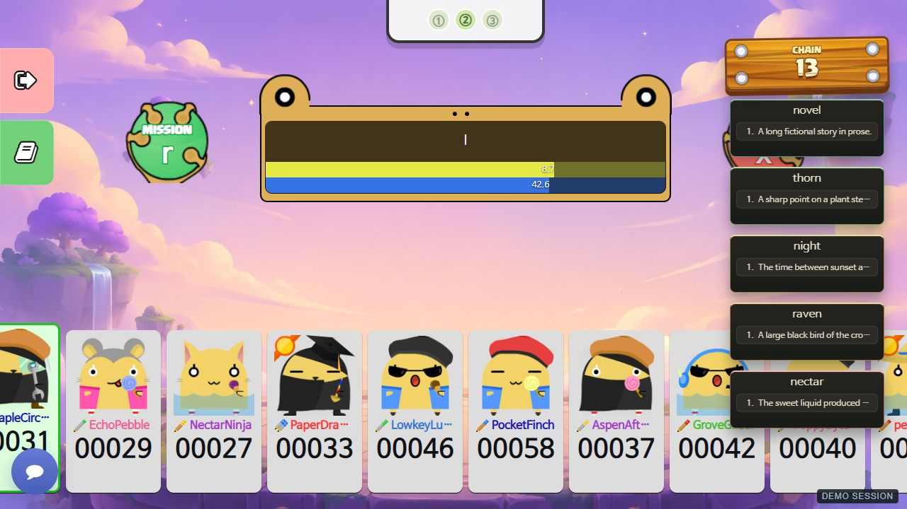
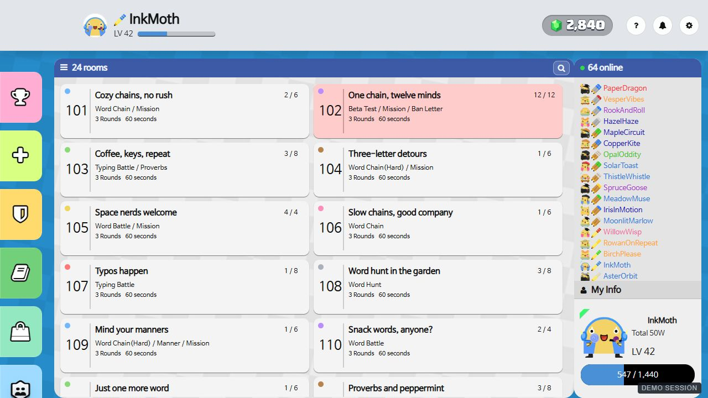
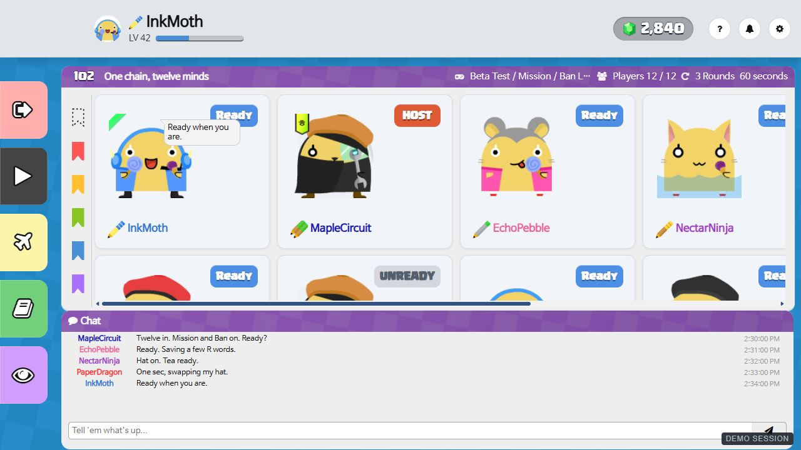
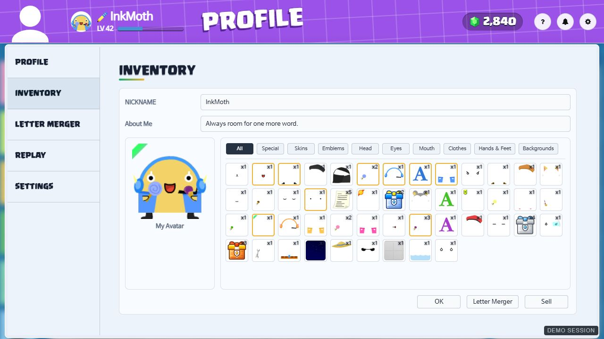
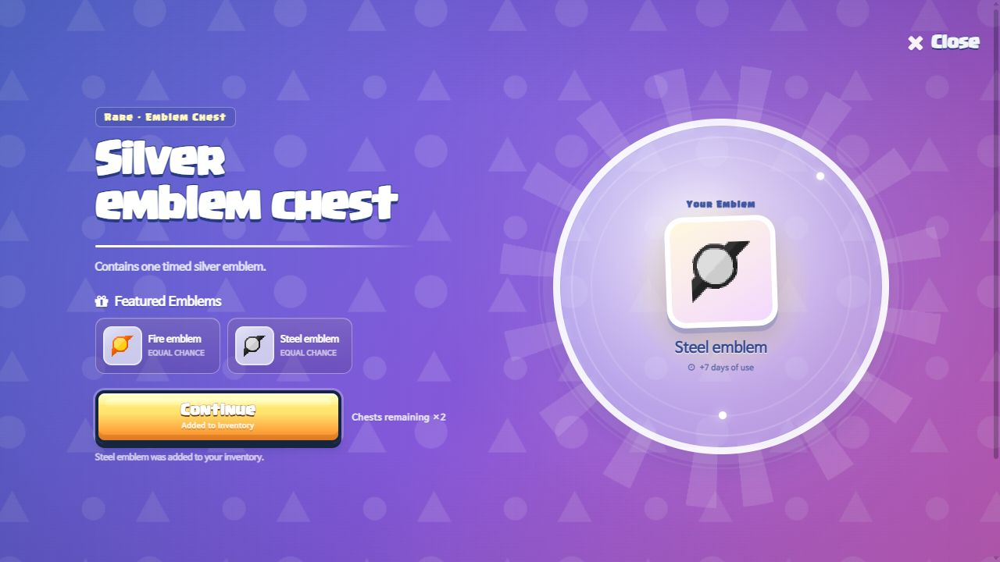
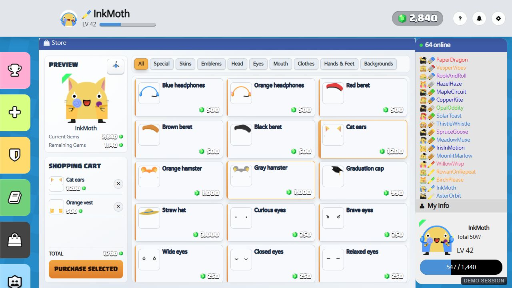
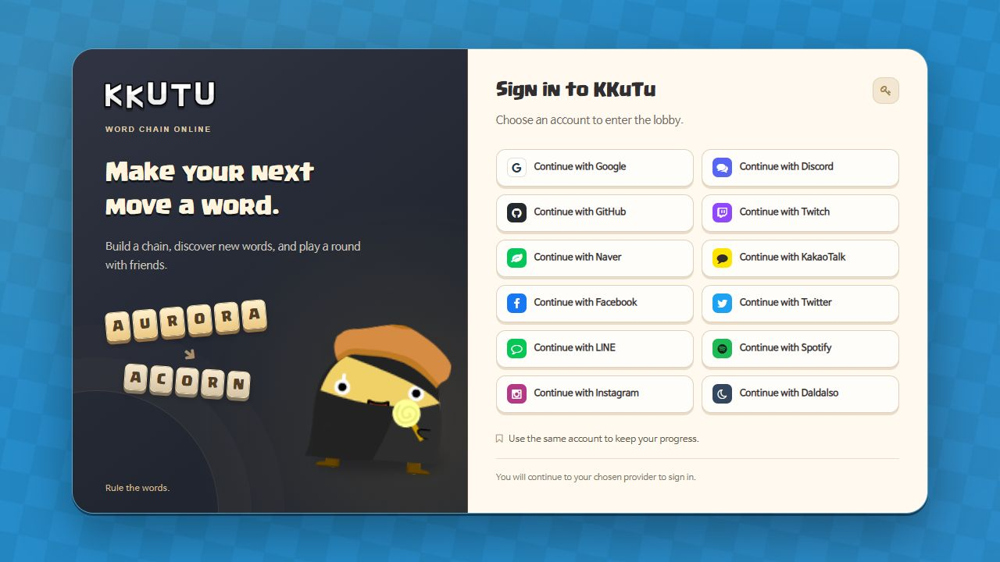

# Demo screenshots

The unrequested player-card, level-icon sizing, sidebar proportion, and HUD overrides were removed on 2026-10-03. These replacement captures use the restored original layout. Its native clipping and scrolling at 1280 × 720 are retained by explicit request; twelve players are present, but they are not all visible simultaneously. The previous capture bundle was archived before restoration.

Seven complete **1280 × 720** game screens, freshly retaken through **Product Design's in-app Browser workflow** at 100% zoom and device pixel ratio 1. Every JPEG is the original screenshot response saved byte for byte. The images show the current templates, styles, avatar layers, item artwork, and client renderers.

The original card renderers and viewport behavior were restored before capture, and UI code stayed fixed while taking the screenshots. No pixels were redrawn, traced, moved, cropped, or resized after capture. [capture-provenance.json](capture-provenance.json) records each capture's time, URL, source snapshot, and matching browser-response/saved-file SHA-256 hashes. Only previously requested lobby tile, Store, login, inventory, English text, and Ranked button refinements remain.

Players, rooms, conversations, inventories, and statistics are fictional demo data. The local adapter replays client messages and simulates actions in memory; it does not connect to production services or a database. The match, lobby, ready-room, inventory, and store captures carry a small **DEMO SESSION** label. The sign-in page uses sample provider availability and does not initiate authentication.

## Beta Test match

Twelve equipped players in round two, with **Mission and Ban Letter enabled**. InkMoth submitted `novel` through the game input, advancing the chain to thirteen and the score to 107. The next turn belongs to MapleCircuit; Mission R is active and X remains banned.

The supplied arena image, `game_img/8e9a668b-3569-4fbb-990e-af576027c7d9.png`, is fitted to the viewport for this local demo only. Production background selection is unchanged.



## Lobby

Sixty-four fictional players and twenty-four rooms, with varied occupancy, natural room titles, waiting and playing states, and room cards that fill the available space. The Ranked control shares the other sidebar buttons' shape and icon treatment.



## Ready room

All twelve players are present, with varied outfit combinations, nickname colors, native level icons, emblems, clan membership, and readiness. The original card positions, native scrolling, and overflow remain intact. Only two short chat balloons are active; earlier conversation remains in the chat history with English timestamps. Added corner clan crests were removed with the unrequested card redesign.



## Inventory

InkMoth's forty-eight owned item entries include cosmetics, colored nicknames, backgrounds, consumables, emblems, and several chest tiers. Equipped items, quantities, category filters, and inventory actions use the native interface.



## Chest opening

The native Silver emblem chest reveals a **Steel emblem with seven days of use**. Opening the chest through its real control reduced the local inventory from three silver chests to two and added the reward.



## Store

Cat ears and an orange vest are selected through the store controls. The avatar previews the outfit, the cart totals 1,700 gems, and the projected balance is 1,140. The preview, cart, purchase action, and catalog remain inside the store surface; gem numbers use white text with a dark outline.



## Sign in

The actual sign-in template uses the game's existing logo and avatar artwork, a restrained ink-and-gold palette, clear provider choices, and formal account guidance.



## Reproduce the captures

Run from the repository root using the installed Pug and Acorn dependencies. No PostgreSQL, Redis, OAuth, or production configuration is required.

Windows PowerShell:

```powershell
Get-Content -Raw -LiteralPath tools/demo_game_server.js | node --preserve-symlinks
```

Other shells:

```sh
node --preserve-symlinks --preserve-symlinks-main tools/demo_game_server.js
```

Open `http://127.0.0.1:4174/?view=lobby`. The server listens only on loopback; `GAME_DEMO_PORT` can change the port.

| Screenshot | URL query | Capture action |
| --- | --- | --- |
| Beta Test match | `?view=game` | Type `novel` in the game input and press Enter; capture the following turn. |
| Lobby | `?view=lobby` | Capture the initial populated view. |
| Ready room | `?view=room` | Capture the initial twelve-player view. |
| Inventory | `?view=inventory` | Capture the initial inventory view. |
| Chest opening | `?view=inventory` | Select Silver emblem chest, click Open Chest, and capture the reward reveal. |
| Store | `?view=shop` | Select Cat ears and Orange vest, return to All, and scroll the catalog to the top. |
| Sign in | `?view=login` | Capture the initial sign-in page. |

Use a **1280 × 720 browser content viewport**, load the selected view at that size, and wait for fonts, avatar images, and `body[data-demo-ready="true"]`. Move the pointer away from expandable sidebar buttons. Capture the viewport without browser chrome, cropping, or image editing. Preserve native clipping instead of repositioning or resizing cards to fit. Reloading restores the fixture.

Enter submits InkMoth's word. Alt + Right advances the next simulated player's turn. These demo interactions use native client handlers and an in-memory adapter; they do not validate production multiplayer or payments.

## Verification

- Inspected each saved image for the complete browser viewport, English interface text, loaded artwork, and the requested original layout, including its existing clipping.
- Compared rendered native reference and restored screens at the same viewport and state; player-card, avatar, level-icon, readiness, and sidebar geometry matches the saved pre-screenshot source. Native level assets are unchanged.
- Submitted `novel` through the real game input: chain 12 → 13, InkMoth score 40 → 107, and the next mission/turn updated.
- Opened the chest through its actual control: three chests → two, with a timed Steel emblem added to inventory.
- Built the store outfit through actual item controls; preview, cart, and projected balance agree.
- Validated room membership, host/readiness data, varied occupancy, item IDs, equipment, quantities, expiry, clan membership, native Beta scoring, and chest consumption semantics.
- Client rendering regressions cover all sixteen modes. The browser reported no JavaScript errors in the captured views.
- The local adapter blocks network connections, rejects HTTP writes, and uses no production database or authentication services.

Image dimensions, byte sizes, and SHA-256 hashes are recorded in [manifest.json](manifest.json). The browser capture records are in [capture-provenance.json](capture-provenance.json). Existing source and asset licenses apply; see the repository [README](../../README.md#license) and [LICENSE](../../LICENSE).
